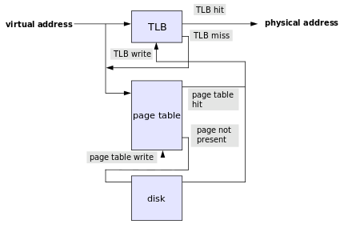
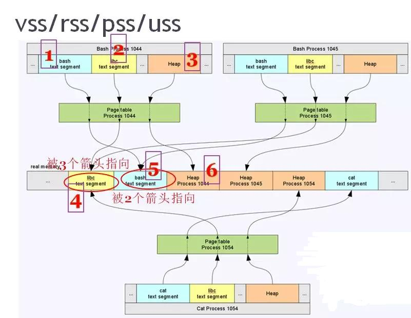

## Page
**A page, memory page, or virtual page is a fixed-length contiguous block of virtual memory, described by a single entry in the page table.**

It is the smallest unit of data for memory management in a virtual memory operating system. Similarly, a **page frame** is the smallest fixed-length contiguous block of physical memory into which memory pages are mapped by the operating system.\
A transfer of pages between main memory and an auxiliary store, such as a hard disk drive, is referred to as paging or swapping.

**Page size** is usually determined by the processor architecture. Traditionally, pages in a system had uniform size, such as 4,096 bytes

**Internal fragmentation:** As an example, assume the page size is 1024 KB. If a process allocates 1025 KB, two pages must be used, resulting in 1023 KB of unused space (where one page fully consumes 1024 KB and the other only 1 KB). 

**Sharing:** In multi-programming or in a multi-user environment, many users may execute the same program, written so that its code and data are in separate pages. To minimize RAM use, all users share a single copy of the program. Each process's page table is set up so that the pages that address code point to the single shared copy, while the pages that address data point to different physical pages for each process.\
Different programs might also use the same libraries. To save space, only one copy of the shared library is loaded into physical memory. Programs which use the same library have virtual addresses that map to the same pages (which contain the library's code and data). When programs want to modify the library's code, they use copy-on-write, so memory is only allocated when needed.\
Shared memory is an efficient way of communication between programs. Programs can share pages in memory, and then write and read to exchange data. 


## Page table
**A page table is the data structure used by a virtual memory system to store the mapping between virtual addresses and physical addresses.**

Virtual addresses are used by the program executed by the accessing process, while physical addresses are used by the hardware, or more specifically, by the RAM subsystem. The page table is a key component of virtual address translation which is necessary to access data in memory. 

### Role of the page table
In operating systems that use virtual memory, every process is given the impression that it is working with large, contiguous sections of memory. Physically, the memory of each process may be dispersed across different areas of physical memory, or may have been moved (paged out) to another storage, typically to a hard disk drive or solid state drive. 

When a process requests access to data in its memory, it is the responsibility of the operating system to map the virtual address provided by the process to the physical address of the actual memory where that data is stored. The page table is where the operating system stores its mappings of virtual addresses to physical addresses, with each mapping also known as a page table entry (PTE).

The CPU's memory management unit (MMU) stores a cache of recently used mappings from the operating system's page table. This is called the translation lookaside buffer (TLB), which is an associative cache.\
When a virtual address needs to be translated into a physical address, the TLB is searched first.

Actions taken upon a virtual to physical address translation. Each translation is restarted if a TLB miss occurs, so that the lookup can occur correctly through hardware.
\

### Translation failures
The page table lookup may fail, triggering a **page fault**, for two reasons:
* The lookup may fail if there is no translation available for the virtual address, meaning that virtual address is invalid. This will typically occur because of a programming error. **It will cause a segmentation fault signal being sent to the offending program.**
* The lookup may also fail if the page is currently not resident in physical memory. This will occur if the requested page has been moved out of physical memory to make room for another page. In this case the page is paged out to a secondary store located on a medium such as a hard disk drive (this secondary store, or "backing store", is often called a "swap partition" if it is a disk partition, or a swap file, "swapfile" or "page file" if it is a file). When this happens the page needs to be taken from disk and put back into physical memory.\
A similar mechanism is used for memory-mapped files, which are mapped to virtual memory and loaded to physical memory on demand.

Some MMUs trigger a **page fault** for other reasons:
* Attempting to write when the page table has the read-only bit set causes a page fault.  This is a normal part of many operating system's implementation of copy-on-write; it may also occur when a write is done to a location from which the process is allowed to read but to which it is not allowed to write, in which case a signal is delivered to the process.
* Attempting to execute code when the page table has the NX bit (no-execute bit) set in the page table causes a page fault. This provide a Write XOR Execute feature that stops some kinds of exploits.

### Page table entry
Each page table entry (PTE) holds the mapping between a virtual address of a page and the address of a physical frame. There is also auxiliary information about the page such as a present bit (indicate what pages are currently present in physical memory or are on disk), a dirty or modified bit, address space or process ID information, amongst others.\
The dirty bit allows for a performance optimization. A page on disk that is paged in to physical memory, then read from, and subsequently paged out again does not need to be written back to disk, since the page has not changed.

## VSS
**Virtual Set Size virtual memory consumption (including virtual memory shared with other processes)**

VSS (denoted as _VSZ_ in the `ps` tool and _VIRT_ in `top`) represents the total accessible address space of the process. This size also includes memory that may not reside in RAM, such as memory that has not been written to after malloc is used to allocate memory.\
It is the sum of all the regions shown in _/proc/<PID>/map_. This number is of limited interest, since only part of the virtual memory is committed to physical memory at any one time.
    
## RSS 
**RSS (Resident Set Size) represents the total memory actually owned by a process in RAM (including shared memory shared with other processes) - is the sum of memory that is mapped to physical pages of memory**

RSS (called _RSS_ in `ps` and _RES_ in `top`) can be misleading because it includes the actual physical memory usage that the process shares with other processes. For example, for shared libraries, it is often loaded into memory only once, regardless of how many processes use it. RSS cannot accurately represent the memory usage of a single process. 

## PSS
**The physical memory actually used by Proportional Set Size (including the memory occupied by other processes in proportion)**

The difference between PSS and RSS is that, for the memory shared between processes, it proportionally reports the size of the shared physical memory used. For example, if there are n processes using a shared library at the same time, the memory of the shared library occupied by a single process is 1/n. If all three processes use a 30-page shared library, then this library will only contribute 10 pages to the PSS reported by each process. \
PSS is a very useful number, because when the PSS of all processes in the system are added together, it can well represent the total memory usage in the system.\
When a process is terminated, the shared library of PSS contributed to it will be proportionally allocated to the total number of PSS of other processes that still use the library. In this way, **PSS may be a bit misleading**, because when the process is terminated, PSS cannot accurately represent the memory returned to the entire system.


## USS
**Unique Set Size physical memory occupied by the process alone (does not include memory shared with other processes)**

USS indicates the total physical memory occupied by the process, which means that this part of the memory is completely exclusive to the process (it is not shared with any other). USS is a very useful number because it represents the actual incremental cost of running a particular process. When the process is terminated, the USS is the total memory actually returned to the system. **When initially suspecting a memory leak in a process, USS is the best monitoring number.**
    
    
## NOTE: There are a few issues to note here

* **The part shared by the two processes is far from only shared libraries. For example, if we open 2 bash processes in Linux, then **these 2 bashs actually share 1 code segment**; of course, the mapping of shared in other mmap() is of course also the memory shared by the two processes.**

* **Not all of the memory in the shared library is shared, only the memory that does not do CoW (copy on write) such as code segments will be shared across processes.**

* **USS removed all shared memory across processes, not just shared libraries.**


## Example
The following is an example to specifically analyze the relationship between various quantities. Assuming that there are two bash processes and one cat process under Linux, the process IDs are 1044, 1045, and 1054, respectively. The following formulas are used to calculate VSS, RSS, PSS, and USS:

_For a single process, in general, the memory size is sorted as follows: VSS >= RSS >= PSS >= USS_

    
* VSS = 1 + 2 + 3
* RSS = 4 + 5 + 6
* PSS = 4/3 + 5/2 + 6
* USS = 6

The 4 memory in the figure above is the part of the libc code segment that resides in the memory and is shared by 3 processes; the 5 memory is the bash code segment and is pointed to by 2 processes (1044 and 1045). When calculating PSS, these need to be scaled.

    

    
```
free

              total        used        free      shared  buff/cache   available
Mem:       10797240     2054984     3904848       19212     4837408     8335428
Swap:        999420      421408      578012

```


```
vmstat

procs -----------memory---------- ---swap-- -----io---- -system-- ------cpu-----
 r  b   swpd   free   buff  cache   si   so    bi    bo   in   cs us sy id wa st
 0  0 421448 3904940 242968 4594336    0    1    10    11    8    2  4  1 95  0  0
```

```
top
```
The top command is useful to check memory and CPU usage per process. It displays information about:
  * uptime
  * average load
  * tasks running
  * number of users logged in
  * number of CPUs/CPU utilization
  * memory/swap system processes

### The detailed description listed below provides an explanation for each value in case you need assistance in analyzing the results.

* Procs
  * r: number of processes waiting for run time.
  * b: number of processes in uninterruptible sleep.

* Memory
  * swpd: amount of virtual memory used.
  * free: amount of idle memory.
  * buff: the amount of memory used as buffers.
  * cache: amount of memory used as cache.
  * 
* Swap
  * si: memory swapped in from disk (/s).
  * so: memory swapped to disk (/s).
* IO
  * bi: Blocks received from a block device (blocks/s).
  * bo: Blocks sent to a block device (blocks/s).
* System
  * in: number of interrupts per second, including the clock.
  * cs: number of context switches per second.

* CPU – These are percentages of total CPU time.
  * us: Time spent running non-kernel code. (user time, including nice time)
  * sy: Time spent running kernel code. (system time)
  * id: Time spent idle. Before Linux 2.5.41, this includes IO-wait time.
wa: Time spent waiting for IO. Before Linux 2.5.41, included in idle.
st: Time stolen from a virtual machine. Before Linux 2.6.11, unknown.
