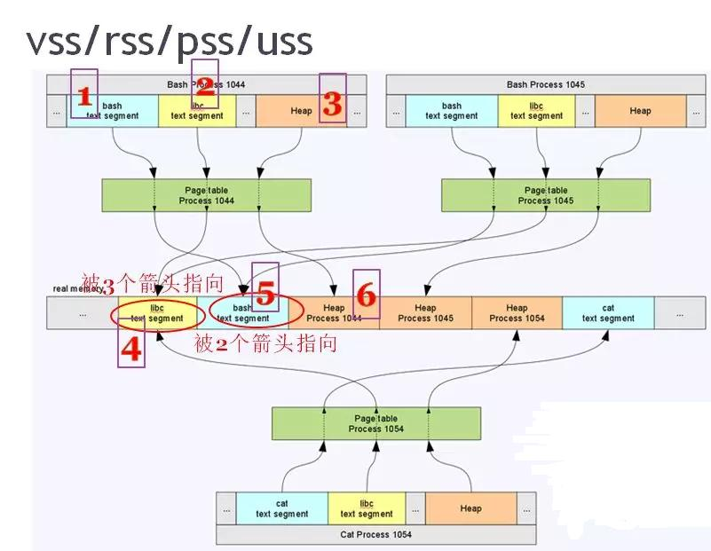

## VSS
**Virtual Set Size virtual memory consumption (including virtual memory shared with other processes)**

VSS (denoted as _VSZ_ in the `ps` tool and _VIRT_ in `top`) represents the total accessible address space of the process. This size also includes memory that may not reside in RAM, such as memory that has not been written to after malloc is used to allocate memory.\
It is the sum of all the regions shown in _/proc/<PID>/map_. This number is of limited interest, since only part of the virtual memory is committed to physical memory at any one time.
    
## RSS 
**RSS (Resident Set Size) represents the total memory actually owned by a process in RAM (including shared memory shared with other processes) - is the sum of memory that is mapped to physical pages of memory**

RSS (called _RSS_ in `ps` and _RES_ in `top`) can be misleading because it includes the actual physical memory usage that the process shares with other processes. For example, for shared libraries, it is often loaded into memory only once, regardless of how many processes use it. RSS cannot accurately represent the memory usage of a single process. 

## PSS
**The physical memory actually used by Proportional Set Size (including the memory occupied by other processes in proportion)**

The difference between PSS and RSS is that, for the memory shared between processes, it proportionally reports the size of the shared physical memory used. For example, if there are n processes using a shared library at the same time, the memory of the shared library occupied by a single process is 1/n. If all three processes use a 30-page shared library, then this library will only contribute 10 pages to the PSS reported by each process. \
PSS is a very useful number, because when the PSS of all processes in the system are added together, it can well represent the total memory usage in the system.\
When a process is terminated, the shared library of PSS contributed to it will be proportionally allocated to the total number of PSS of other processes that still use the library. In this way, **PSS may be a bit misleading**, because when the process is terminated, PSS cannot accurately represent the memory returned to the entire system.


## USS
**Unique Set Size physical memory occupied by the process alone (does not include memory shared with other processes)**

USS indicates the total physical memory occupied by the process, which means that this part of the memory is completely exclusive to the process (it is not shared with any other). USS is a very useful number because it represents the actual incremental cost of running a particular process. When the process is terminated, the USS is the total memory actually returned to the system. **When initially suspecting a memory leak in a process, USS is the best monitoring number.**
    
    
## NOTE: There are a few issues to note here

* **The part shared by the two processes is far from only shared libraries. For example, if we open 2 bash processes in Linux, then **these 2 bashs actually share 1 code segment**; of course, the mapping of shared in other mmap() is of course also the memory shared by the two processes.**

* **Not all of the memory in the shared library is shared, only the memory that does not do CoW (copy on write) such as code segments will be shared across processes.**

* **USS removed all shared memory across processes, not just shared libraries.**


## Example
The following is an example to specifically analyze the relationship between various quantities. Assuming that there are two bash processes and one cat process under Linux, the process IDs are 1044, 1045, and 1054, respectively. The following formulas are used to calculate VSS, RSS, PSS, and USS:

_For a single process, in general, the memory size is sorted as follows: VSS >= RSS >= PSS >= USS_

    
* VSS = 1 + 2 + 3
* RSS = 4 + 5 + 6
* PSS = 4/3 + 5/2 + 6
* USS = 6

The 4 memory in the figure above is the part of the libc code segment that resides in the memory and is shared by 3 processes; the 5 memory is the bash code segment and is pointed to by 2 processes (1044 and 1045). When calculating PSS, these need to be scaled.

    

    
```
free

              total        used        free      shared  buff/cache   available
Mem:       10797240     2054984     3904848       19212     4837408     8335428
Swap:        999420      421408      578012

```


```
vmstat

procs -----------memory---------- ---swap-- -----io---- -system-- ------cpu-----
 r  b   swpd   free   buff  cache   si   so    bi    bo   in   cs us sy id wa st
 0  0 421448 3904940 242968 4594336    0    1    10    11    8    2  4  1 95  0  0
```

```
top
```
The top command is useful to check memory and CPU usage per process. It displays information about:
  * uptime
  * average load
  * tasks running
  * number of users logged in
  * number of CPUs/CPU utilization
  * memory/swap system processes

### The detailed description listed below provides an explanation for each value in case you need assistance in analyzing the results.

* Procs
  * r: number of processes waiting for run time.
  * b: number of processes in uninterruptible sleep.

* Memory
  * swpd: amount of virtual memory used.
  * free: amount of idle memory.
  * buff: the amount of memory used as buffers.
  * cache: amount of memory used as cache.
  * 
* Swap
  * si: memory swapped in from disk (/s).
  * so: memory swapped to disk (/s).
* IO
  * bi: Blocks received from a block device (blocks/s).
  * bo: Blocks sent to a block device (blocks/s).
* System
  * in: number of interrupts per second, including the clock.
  * cs: number of context switches per second.

* CPU – These are percentages of total CPU time.
  * us: Time spent running non-kernel code. (user time, including nice time)
  * sy: Time spent running kernel code. (system time)
  * id: Time spent idle. Before Linux 2.5.41, this includes IO-wait time.
wa: Time spent waiting for IO. Before Linux 2.5.41, included in idle.
st: Time stolen from a virtual machine. Before Linux 2.6.11, unknown.
