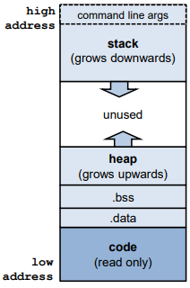
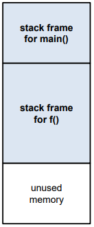
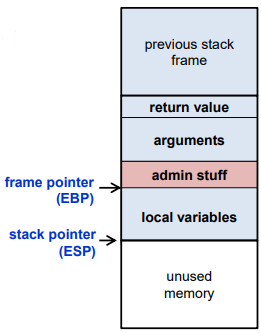
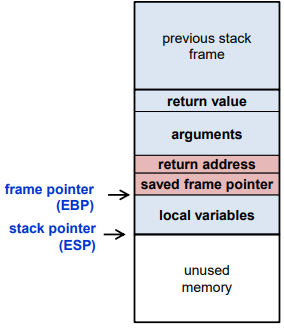

# Memory Segments

The OS allocates memory for each process for data and code.

This memory consists of different segments
* **stack** 
  * for local variables (incl. command line arguments) and environment variables
* **heap**
  * for dynamic memory
* **data segment** for:
  * global uninitialised variables (.bss)
  * global initialised variables (.data)
* **code segment**: typically read-only



Shows memory regions of process <pid>:
```
$ cat /proc/<pid>/maps
```
 
 
## Global variables (in .bss and .data)

These are the easy ones for the compiler to deal with.

```
#include <stdio.h>
long n = 12345;
char *string = "hello world\n";
int a[256];
...
```
Here
* The global variables **n**, string and the string literal ”**hello world\n**”, will be allocated in **.data**
* The uninitialised global array a will be allocated in **.bss**. The segment .bss is initialised to all zeroes. NB this is a rare case where C will do a default initialisation for the programmer!
  
## The stack
 
The stack consists of stack frames aka activation records, one for each function call,
* allocated when a function is called,
* de-allocated when it returns.
 
```
main(int i){
 char *msg =”hello”;
 f(msg);
}
 
int f(char *p){
 int j;
 ..;
 return 5;
}
```



On most machines, the stack grows downward. The stack pointer (SP) points to the last element on the stack. On x86 architectures, the stack pointer is stored in the ESP (Extended Stack Pointer) register.
 
Each stack frame provides memory for
* arguments
* the return value
* local variables
 
of a function, plus some admin stuff .
 
The frame pointer provides a starting point to locate the local variables, using offsets.\
On x86 architectures, it is stored in the EBP (Extended Base Pointer) register.
 

 
The admin stuff stored on the stack :
* return address (ie where to resume execution after return)
* previous frame pointer (to locate previous frame)
 

 
### Function calls
When a function is called, a new stack frame is created
 * arguments are stored on the stack
 * current frame pointer and return address are recorded
 * memory for local variables is allocated
 * stack pointer is adjusted

When a function returns, the top stack frame is removed
 * old frame pointer and return address are restored
 * stack pointer is adjusted
 * the caller can find the return value, if there is one, on top of the stack
 
Because of recursion, there may be multiple frames for the same function on the stack
* Note that the variables that are stored in the current stack frame are precisely the variables that are in scope.
 
