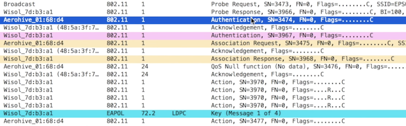

## Driver install on Kali Linux
```
# check dirver Vendor (lsusb if the netowrk card is on usb or lspci if it is an internal one)
lsusb
lspci

apt-get update
apt-get install synaptic -y
```

Open Synaptic Package Manager application
* Press search button
* In the search field type driver vendor name (broadcom)
* Right click on broadcom-sta-dkms and choose Mark for Instalation
* Press Mark button


Open Synaptic Package Manager application
* Press search button
* In the search field type: `linux-image`
* Make sure that linux-headers-4.15.0-kali2-amd64 has the same version with linux-image-4.15.0-kali2-amd64 (4.15)\
Remove the wrong package (linux-image-4.14.0-kali3-amd64) and install the right one


## The packet flow of a wireless client associating to an access point


* EAPOL data packets are used for the 4 way handshake
* QoS Data packets contains encrypted data

## The Probe request, Authentication, Association asnd Handshake packets:


## Wireshark filters
* To fliter the packets form the client: wlan.addr == <mac addr>
* Filer for protocols: bootp icmp

## How to decrypt IEE 802.11 traffic
  
Wireshark -> Preferences -> Protocols -> IEE 802.11\
Edit Decryption keys and add:
* Key type: wpa-pwd
* Key: <preshared key>:<ssid>


## Caputre WiFi packests using Kali linux:
 
Check the WiFi device driver
```
$ lsusb
Bus 002 Device 003: ID 0cf3:9271 Qualcomm Atheros Communications AR9271 802.11n

$ lspci
```
  
```
$ sudo airmon-ng
PHY     Interface       Driver          Chipset
phy0    wlan0           ath9k_htc       Qualcomm Atheros Communications AR9271 802.11n
```

```
$ sudo airmon-ng check
Found 2 processes that could cause trouble.
Kill them using 'airmon-ng check kill' before putting
the card in monitor mode, they will interfere by changing channels
and sometimes putting the interface back in managed mode

    PID Name
    549 NetworkManager
    650 wpa_supplicant
```

```
$ sudo airmon-ng check kill

Killing these processes:

    PID Name
    650 wpa_supplicant
```

```
$ sudo airmon-ng check
```
  
```
# sudo airmon-ng start <interface name> <channel id>
$ sudo airmon-ng start wlan0 10
PHY     Interface       Driver          Chipset

phy0    wlan0           ath9k_htc       Qualcomm Atheros Communications AR9271 802.11n
                (mac80211 monitor mode vif enabled for [phy0]wlan0 on [phy0]wlan0mon)
                (mac80211 station mode vif disabled for [phy0]wlan0)
```

Confirm the card is in monitor mode:
```
$ iwconfig
lo        no wireless extensions.

eth0      no wireless extensions.

wlan0mon  IEEE 802.11  Mode:Monitor  Frequency:2.457 GHz  Tx-Power=20 dBm   
          Retry short limit:7   RTS thr:off   Fragment thr:off
          Power Management:off
```

To capture packets without wireshark
```
$ airodump-ng --channel 11 --bssid 90:99:90:99:90:99 wlan0mon
```

To stop the monitor mode:
```
$ sudo airmon-ng stop wlan0mon
```
